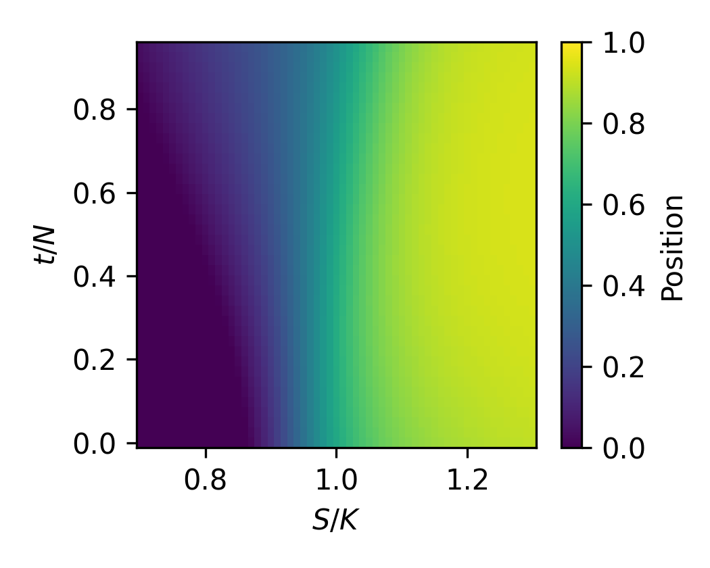

# Deep Hedging with Reinforcement Learning

A PPO agent that learns to hedge a European call option — and recovers the
Black–Scholes delta from reward alone, without ever being told what delta is.




## What this is

A from-scratch reinforcement-learning approach to option hedging. A PPO agent is
trained on simulated Geometric Brownian Motion price paths to hedge a short
European call, framed as a Markov Decision Process with a self-financing bank
account. The agent is evaluated against the classical Black–Scholes delta-hedging
benchmark, with and without transaction costs.

📄 **[Read the full report](0.0_Paper/Deep_Hedging_under_Transaction_Costs__A_Reinforcement_Learning_Study.pdf)**

## Key results

- **The agent recovers the Black–Scholes delta surface** from reward alone —
  its learned position as a function of moneyness and time closely matches the
  theoretical hedge ratio, despite never observing it.
- **Under transaction costs, the agent converges to a near-static hedge** rather
  than continuous replication — a rational, cost-minimizing response that trades
  hedging quality for lower trading costs.
- **The policy generalizes across strike levels** it was never trained on, and
  **degrades gracefully under volatility mismatch**, its error growing more
  slowly than fixed-volatility delta-hedging as realized volatility rises.
- As a bonus, the simulation-trained agent **transfers to real market data**,
  tracking a sensible hedge on a live underlying price path.

## The story behind it

This project was as much a debugging exercise as a modelling one. Early agents
collapsed to degenerate policies — first a **bang-bang policy** (jump fully in,
then fully out), which turned out to be the *correct* optimum of a misspecified
reward that had no cash account. Adding a **self-financing bank account** fixed
the objective. Later, high entropy and small rollout buffers caused **training
instability** (a rise-then-collapse learning curve), resolved by tuning
exploration and enlarging the buffer. Under transaction costs, the agent found
yet another degenerate optimum — a **static buy-and-hold hedge** — which,
rather than being "fixed", became an interesting finding in its own right about
how costs reshape the optimal policy. The final agent is a genuine dynamic
hedger, and the evaluation quantifies exactly where and why it departs from
Black–Scholes.

## Repository structure

```
.
├── 1.0_Model_Training/
│   ├── Train_Models.py          # MDP env (HedgingEnv), PPO training, hyperparameter grid
│   ├── Evaluate_Models.py       # single-model diagnostic rollouts
│   ├── Training_Curve.py        # plots learning curves from eval logs
│   └── Trained_Models/          # (regenerated by training; see note below)
│       └── grid_results.csv     # best validation reward per configuration
├── 2.0_Model_Evaluation/
│   ├── Common.py                # shared rollout / benchmark / stats functions
│   ├── 2.1_Sensitivity_Analysis/    # hyperparameter grid table + learning curves
│   ├── 2.2_NoCost_Analysis/         # no-cost P&L, paths, histogram
│   ├── 2.3_Cost_Analysis/           # cost P&L, paths, histogram
│   ├── 2.4_Regime_Comparison/       # per-strike table + delta surfaces
│   └── 2.5_Volatility_Robustness/   # volatility-mismatch table + curves
└── 3.0_Hedging_SPY_(NOT_IN_REPORT)/ # bonus: agent applied to real market data
    ├── fetch_data.py            # downloads price data (run locally, needs internet)
    └── real_hedging.py          # runs the trained agent on the real path
```

## Reproducing the results

**Requirements:** Python 3.14+ and the packages in `requirements.txt`:

**Pipeline (run in order):**
1. `python 1.0_Model_Training/Train_Models.py` — trains the 18-model grid
   (~3 hours on CPU). Produces `Trained_Models/` and `grid_results.csv`.
2. Set the selected configurations in `2.0_Model_Evaluation/common.py`
   (the `SELECTED` dict), based on `grid_results.csv`.
3. Run the evaluation scripts `2.1` through `2.5` — each produces the tables
   and figures for its section.

The trained model binaries are not committed (they are large and fully
regenerated by step 1). The bonus module in `3.0_Real_Data/` requires internet
for `fetch_data.py`; the resulting price CSV is committed so `real_hedging.py`
runs offline.

## Notes

- The MDP formulation, experimental design, and analysis are documented in the
  accompanying report.
- AI assistance (Claude) was used for debugging, code structuring, and drafting;
  all modelling decisions and interpretations were made and verified by the
  author.

## License

MIT — see [LICENSE](LICENSE).